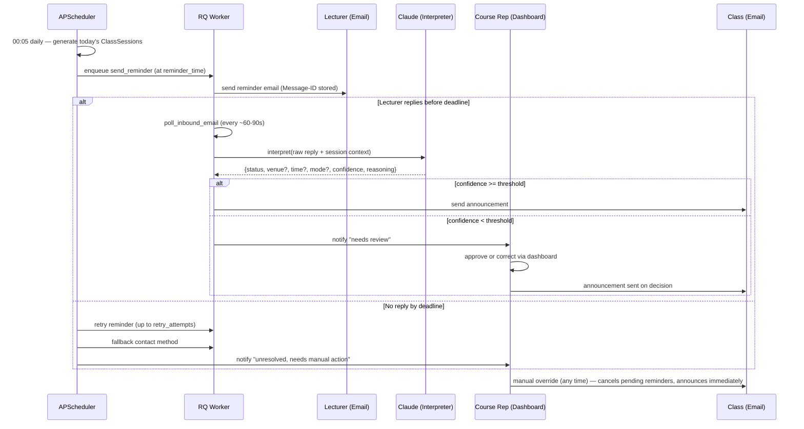
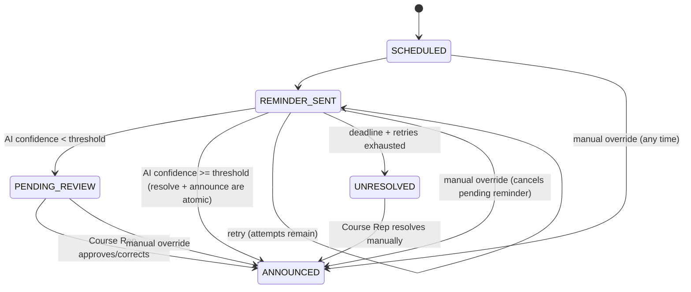

# ClassFlow AI — Project Source of Truth

Status: **V1 implemented and running end-to-end** (backend, scheduler/worker pipeline, frontend, all verified against live Postgres/Redis and, for the notification/scheduling loop, inside Docker). Not yet deployed to the VPS or connected to real SMTP/IMAP/Anthropic credentials. This document is the single source of truth for vision, scope, architecture, and roadmap. Update it whenever a decision changes — do not let it drift from reality.

---

## 1. Vision & Purpose

Automate the manual work of a Course Representative: asking lecturers whether a scheduled class is holding, interpreting the reply, and relaying it to the class. ClassFlow AI replaces that manual relay with:

`Scheduler → Reminder → Lecturer reply → AI interpretation → Status update → Announcement → Audit log`

Built first for one person (the author) managing four MSc courses. The architecture must scale to more courses, more course reps, and more channels — but the MVP implements only what today's workflow needs.

---

## 2. Scope

### In scope (V1)
- Single authenticated Course Rep user (no public registration).
- Manage semesters, courses, lecturers, timetable slots.
- Automatic daily generation of class sessions from the timetable.
- Automatic email reminders to lecturers with configurable retry/fallback.
- Inbound lecturer replies read via **IMAP polling** of a dedicated mailbox.
- AI (Anthropic Claude) interprets replies into structured status changes.
- **Auto-announce above a confidence threshold; hold for Course Rep approval below it.**
- Manual override from the dashboard at any time (cancels pending reminders, announces immediately).
- Announcement to students by **email** (V1) — see ADR-1.
- Full audit log of every state change.
- Course lifecycle: ACTIVE / PAUSED / COMPLETED.

### Explicitly out of scope (V1)
- Student accounts, registration, or consent collection.
- WhatsApp in any form (lecturer channel or student announcement) — deferred, but the notification layer is built provider-agnostic so it's a clean adapter addition later.
- Multi-user / multi-course-rep support (schema allows it, no UI/permissions work for it yet).
- Public inbound webhooks (no public domain/TLS requirement for V1 — IMAP polling only).
- Calendar/holiday exceptions — schema included (cheap to add now), scheduling logic deferred to V1.1.

---

## 3. Users & Roles

**Course Representative** (only login-capable user): manages lecturers/courses/timetable, triggers/overrides announcements, approves low-confidence AI interpretations, views audit history, pauses/completes courses.

**Lecturer**: no login. Receives reminder emails, replies in natural language. Never touches the app directly.

**Students**: not modeled. Recipients of the announcement email only.

---

## 4. Core Workflow



---

## 5. Architecture Decision Log

| # | Decision | Rationale |
|---|---|---|
| ADR-1 | **Student announcement is email in V1, not WhatsApp.** | The original flow diagram implied WhatsApp group posting from day one, but there's no free/safe way to post into an existing personal WhatsApp group: the official Business API requires Meta approval, pre-approved templates, and per-message cost; unofficial libraries (Baileys/whatsapp-web.js) require linking a personal number and risk an account ban. Confirmed with the Course Rep: V1 announces by email; WhatsApp (both lecturer-side and student-side) is a fast-follow behind the `NotificationChannel` interface (§10). |
| ADR-2 | **Inbound lecturer replies via IMAP polling, not a webhook.** | Avoids requiring a public domain, DNS/MX records, and a publicly reachable, signature-verified endpoint for V1. Trades ~60-90s latency for zero public attack surface. Revisit if/when a webhook provider (Mailgun/SES) is already needed for something else. |
| ADR-3 | **AI auto-announces above a confidence threshold; below it, queues for Course Rep approval.** Threshold confirmed at `0.75` (`AI_CONFIDENCE_THRESHOLD`). | A wrong auto-post goes straight to the whole class. Clear replies ("No class today") post automatically; ambiguous, multi-intent, or off-topic replies wait for a human. Threshold is a tunable config value, not hardcoded, and every decision (auto or manual) is logged so the threshold can be recalibrated from real data. |
| ADR-4 | **AI provider is Anthropic Claude**, called through a `MessageInterpreter` port. Model confirmed as **Claude Haiku 4.5** (`ANTHROPIC_MODEL`). | Structured output via forced tool-calling (not free-text parsing) for reliability. Provider-agnostic interface means swapping models/providers later touches one adapter, not business logic. Haiku chosen over Sonnet for cost/speed on a narrow 6-way classification task; revisit if real usage shows its confidence scores are unreliable. |
| ADR-5 | **APScheduler decides *when*, RQ decides *how*.** | APScheduler (persisted job store in Postgres) fires lightweight "enqueue this" triggers. RQ workers do the actual I/O (SMTP, IMAP, Claude calls) with RQ's own retry/timeout handling. Keeps the scheduler process non-blocking and lets workers scale independently. |
| ADR-6 | **Clean architecture with explicit ports/adapters** for AI and notifications. | `NotificationChannel` and `MessageInterpreter` are interfaces defined in the domain/application layer; concrete adapters (SMTP email, Claude, future WhatsApp) live in infrastructure. Business logic never imports a vendor SDK directly. |
| ADR-7 | **Timezone is `Africa/Lagos`.** Confirmed with the Course Rep. | Inferred from Nigerian MSc course-code conventions (CSC/SEN numbering), then confirmed directly. All timestamps stored in UTC in Postgres; converted at the API/frontend boundary. |
| ADR-8 | **Workflow status and outcome are separate fields** on `ClassSession`. | `status` tracks where the session is in the pipeline (SCHEDULED → REMINDER_SENT → …→ ANNOUNCED). `outcome` tracks the actual class result (CONFIRMED/CANCELLED/DELAYED/RELOCATED/ONLINE/UNRESOLVED). Conflating them was a gap in the original spec — without this split, "delayed but not yet announced" and "delayed and announced" can't be distinguished. |
| ADR-9 | **`TimetableSlot` (recurring template) is separate from `ClassSession` (concrete daily instance).** | Editing a session for one specific day (delay, relocation) must never mutate the recurring template. Sessions are generated daily from active slots; a slot change only affects sessions generated after the change. |
| ADR-10 | **SQLAlchemy ORM models double as domain entities** rather than maintaining a separate set of plain domain dataclasses. Ports (`app/domain/ports.py`) type-hint against them directly. | Full separation (mapper classes translating ORM rows to distinct domain objects) is standard clean-architecture practice but is pure ceremony for a solo MVP with no second persistence backend on the roadmap. The pragmatic cost: unit tests using fake repositories must construct `Reminder.status` etc. explicitly rather than relying on SQLAlchemy's flush-time column defaults, since those defaults only apply once a row actually goes through a real `AsyncSession.flush()`. Caught this the hard way in `CourseService.create_course` (§16) — fixed by setting `status=CourseStatus.ACTIVE` explicitly at construction instead of depending on the mapped_column default. |
| ADR-11 | **A reminder's delivery outcome (SMTP success/failure) is recorded only in the audit log, never in `Reminder.status`.** `status` stays `SENT` regardless of whether the send succeeded; only `handle_deadline` sets `EXPIRED`, only once the deadline actually passes with no response. | A bug caught by the scheduler-wiring integration test: marking a failed send as `EXPIRED` immediately short-circuited the retry logic (which only acts on `SENT` reminders), silently stranding the session. A bounced/failed send should flow through the same retry → fallback path as a real non-response, not a separate one. |
| ADR-12 | **Resolving a session's outcome and announcing it are one atomic step**, not `PENDING_REVIEW/REMINDER_SENT → RESOLVED → ANNOUNCED` as originally sketched in §7. | Every path that determines an outcome (auto-approval above the confidence threshold, Course Rep approve/reject, manual override) needs to announce it — there was no use case in V1 for "resolved but not yet announced" as a distinct, addressable state. `SessionStatus.RESOLVED` is kept in the enum as a reserved value (e.g. for a future "resolved but announcement delivery failed" state) but nothing currently transitions into it. |
| ADR-13 | **Default reminder timing for new timetable slots, confirmed with the Course Rep: 60-minute response deadline, 1 retry, 30 minutes between attempts** (~90 minutes total before a session is marked `UNRESOLVED` and the Course Rep is notified). | These are the `TimetableSlotCreate` schema defaults (`response_deadline_minutes=60, retry_attempts=1, retry_interval_minutes=30`) — sensible when reminders go out a few hours ahead of class. Per-slot values are always overridable if a specific course needs a different cadence. |

---

## 6. Tech Stack

| Layer | Choice |
|---|---|
| Backend | FastAPI, Python 3.12, SQLAlchemy 2.0 (async), Alembic |
| Database | PostgreSQL 16 |
| Background jobs | Redis + RQ |
| Scheduling | APScheduler (SQLAlchemyJobStore, persisted) |
| AI | Anthropic Claude (Haiku-class model, tool-calling for structured output) |
| Email (outbound) | SMTP via transactional provider (e.g. Postmark/SES SMTP) |
| Email (inbound) | IMAP polling of a dedicated mailbox |
| Auth | JWT (short-lived access token + httpOnly-cookie refresh token) |
| Frontend | React 18, TypeScript, Vite, TailwindCSS, React Query, React Router, react-hook-form + zod |
| Deployment | Docker Compose (backend, worker, scheduler, frontend, postgres, redis as separate services) |

---

## 7. Domain Model & Database Schema

### Entities

**semesters** — `id, name, start_date, end_date, timezone, is_active, created_at`

**courses** — `id, semester_id FK, code, title, status(ACTIVE|PAUSED|COMPLETED), announcement_email, created_at, updated_at`

**lecturers** — `id, name, email, phone, preferred_contact_method(EMAIL|WHATSAPP*), fallback_contact_method(EMAIL|WHATSAPP*), created_at, updated_at`
  *(`WHATSAPP` present in the enum for forward compatibility; API rejects it as a selectable value until the adapter exists — see ADR-1.)*

**course_lecturers** — `course_id FK, lecturer_id FK, is_primary bool` (many-to-many; MVP UI only exercises one primary lecturer per course, schema allows co-taught courses without a migration later)

**timetable_slots** — `id, course_id FK, day_of_week(0-6), start_time, end_time, venue, mode(IN_PERSON|ONLINE|HYBRID), reminder_time, response_deadline_minutes, retry_attempts, retry_interval_minutes, fallback_contact_method_override, is_active`

**class_sessions** — `id, course_id FK, timetable_slot_id FK NULL, session_date, scheduled_start_time, scheduled_end_time, venue, mode, status, outcome NULL, final_start_time NULL, final_venue NULL, final_mode NULL, resolution_source(PENDING|LECTURER_RESPONSE|MANUAL_OVERRIDE|NO_RESPONSE_FALLBACK), announced_at NULL, created_at, updated_at`
  Unique constraint: `(timetable_slot_id, session_date)` — prevents duplicate generation on scheduler restart.

  `status`: `SCHEDULED → REMINDER_SENT → (PENDING_REVIEW | RESOLVED | UNRESOLVED) → ANNOUNCED`
  `outcome`: `NULL → CONFIRMED | CANCELLED | DELAYED | RELOCATED | ONLINE | UNRESOLVED`

**reminders** — `id, class_session_id FK, attempt_number, channel(EMAIL), sent_at, deadline_at, outbound_message_id, status(SENT|RESPONDED|EXPIRED|CANCELLED), apscheduler_job_id NULL`
  `outbound_message_id` = the `Message-ID` header we set when sending, used to match inbound replies via `In-Reply-To`/`References` during IMAP polling.

**lecturer_responses** — `id, reminder_id FK, class_session_id FK, raw_message, cleaned_message, received_at, ai_status enum, ai_new_time NULL, ai_new_venue NULL, ai_new_mode NULL, ai_confidence float, ai_raw_output jsonb, requires_review bool, model_name, prompt_version`

**announcements** — `id, class_session_id FK, channel(EMAIL), recipient, content, sent_at, status(SENT|FAILED)`

**audit_logs** — `id, entity_type, entity_id, action, actor(SYSTEM|LECTURER|COURSE_REP), previous_state jsonb NULL, new_state jsonb NULL, note NULL, created_at`
  Append-only. Every status transition, override, and AI decision writes one row here — this is what the dashboard's session timeline renders from.

**calendar_exceptions** — `id, semester_id FK, date, reason, course_id NULL` (NULL = university-wide). Schema included now; scheduling logic to respect it is V1.1.

**users** — `id, email, hashed_password, created_at` (single row in practice; kept as a normal table for future multi-user)

### Class Session State Machine



As built, resolving and announcing collapsed into one atomic service-layer step — every path that determines an outcome (auto-approval, Course Rep approve/reject, override) sends the announcement in the same transaction rather than passing through a separate `RESOLVED` status first. `SessionStatus.RESOLVED` is still defined in the enum (reserved — e.g. for a future "resolved but announcement delivery failed, don't re-resolve" state) but nothing currently sets it.

---

## 8. API Design (`/api/v1`)

| Method | Path | Purpose |
|---|---|---|
| POST | `/auth/login` | Issue access + refresh token |
| POST | `/auth/refresh` | Rotate access token |
| GET/POST | `/semesters` | List / create |
| PATCH | `/semesters/{id}` | Update |
| POST | `/semesters/{id}/activate` | Set active semester |
| GET/POST | `/courses` | List / create |
| GET/PATCH | `/courses/{id}` | Detail / update |
| POST | `/courses/{id}/pause` \| `/resume` \| `/complete` | Lifecycle transitions |
| GET/POST | `/lecturers` | List / create |
| GET/PATCH/DELETE | `/lecturers/{id}` | Detail / update / remove |
| GET/POST/DELETE | `/courses/{id}/lecturers` | List / attach / detach, set primary |
| GET/POST | `/courses/{id}/timetable-slots` | List / create |
| PATCH/DELETE | `/timetable-slots/{id}` | Update / remove |
| GET | `/class-sessions?date_from=&date_to=&course_id=&status=` | Filtered list — the frontend uses this directly for both "today" (date_from=date_to=today) and "pending review" (status=PENDING_REVIEW); no separate `/dashboard/*` endpoints exist |
| GET | `/class-sessions/{id}` | Full detail incl. reminders, responses, announcements |
| POST | `/class-sessions/{id}/override` | `{outcome, venue?, start_time?, mode?, note}` — immediate announce, cancels pending reminders |
| POST | `/class-sessions/{id}/resend-reminder` | Manual re-trigger |
| POST | `/class-sessions/{id}/approve` | Accept AI interpretation as-is (PENDING_REVIEW → ANNOUNCED) |
| POST | `/class-sessions/{id}/reject` | Correct interpretation manually (→ becomes an override) |
| GET | `/audit-logs?entity_type=&entity_id=&date_from=&date_to=` | Audit trail query |

All mutating endpoints require the JWT; all writes go through the application-layer service, which is what actually writes the `audit_logs` row — routers never write audit entries directly.

---

## 9. Scheduler Design

**Process separation:** `scheduler` runs as its own container/process (not inside the API process), so scaling the API to multiple replicas never double-schedules a job.

**Job store:** `SQLAlchemyJobStore` against Postgres — schedule survives restarts/deploys.

**Jobs:**
1. `generate_daily_sessions` (cron, 00:05 local) — for each active `TimetableSlot` whose course is `ACTIVE` and `day_of_week == today` (and, from V1.1, no blocking `CalendarException`), create the `ClassSession` row (idempotent via the unique constraint) and schedule jobs 2–3 for it.
2. `send_reminder(class_session_id, attempt_number)` — one-off date trigger; enqueues the RQ `send_reminder_task`.
3. `check_response_deadline(class_session_id, attempt_number)` — one-off date trigger at `deadline_at`; **re-reads current DB state before acting** (a response or manual override may have already resolved it), then either enqueues a retry, triggers fallback, or marks `UNRESOLVED` + notifies the Course Rep.
4. `poll_inbound_email` (interval, ~60-90s) — enqueues the RQ `poll_inbound_email_task`.

**Cancellation:** `Reminder.apscheduler_job_id` is stored when a job is scheduled so a manual override or early response can call `scheduler.remove_job(...)` to cancel the corresponding retry/deadline jobs — this is what stops a late reminder from firing after the Course Rep has already resolved the session by hand.

---

## 10. Notification Service Design

Business logic depends only on this interface (domain/application layer):

```python
class NotificationChannel(Protocol):
    async def send(self, to: str, subject: str, body: str) -> DeliveryResult: ...

class MessageInterpreter(Protocol):
    async def interpret(self, raw_message: str, context: SessionContext) -> Interpretation: ...
```

V1 registers exactly one `NotificationChannel` adapter: `SmtpEmailChannel`. A `NotificationRouter` resolves which adapter to use per lecturer (`preferred_contact_method`, falling back to `fallback_contact_method` after retries exhaust) — in V1 both always resolve to email, but the routing logic doesn't need to change when a `WhatsAppChannel` adapter is added later; only the adapter registry does.

The class announcement uses the same interface with a different recipient (`Course.announcement_email`) — not a separate code path.

---

## 11. AI Interpretation Pipeline

**Input:** course code/title, lecturer name, scheduled date/time/venue/mode, and the *cleaned* reply body (quoted history and signature blocks stripped before it ever reaches the model — reduces tokens and avoids the model latching onto quoted reminder text).

**Output:** forced via Claude tool-calling (a single `record_interpretation` tool with a strict JSON schema) — never free-text parsing:

```json
{
  "status": "CONFIRMED | CANCELLED | DELAYED | RELOCATED | ONLINE | UNCLEAR",
  "new_time": "HH:MM | null",
  "new_venue": "string | null",
  "new_mode": "IN_PERSON | ONLINE | HYBRID | null",
  "confidence": 0.0,
  "reasoning": "one sentence"
}
```

**Confidence handling:** the model self-reports confidence against an explicit rubric in the system prompt (high = unambiguous single statement about class status; medium = implied/partial; low = off-topic, contradictory, or multi-intent). This is a heuristic, not a calibrated probability — treat the auto-announce threshold as a tunable config value, and log every `(raw_message, interpretation, confidence, auto_announced?)` tuple so the threshold can be reviewed and adjusted from real data (`lecturer_responses` + `audit_logs` already capture this — no extra table needed).

`status == UNCLEAR` always routes to `PENDING_REVIEW` regardless of the numeric confidence value.

Full raw model output, model name, and prompt version are stored per-response (`lecturer_responses.ai_raw_output`, `.model_name`, `.prompt_version`) so prompt changes are auditable and reproducible.

---

## 12. Frontend Architecture

Feature-folder structure, React Query for all server state (no separate global store beyond a thin auth context), Tailwind for styling, react-hook-form + zod for forms (schemas mirrored from backend Pydantic models).

**Screens:**
- **Login**
- **Dashboard / Today** — one card per course showing today's session status and quick actions
- **Pending Review** — queue of `PENDING_REVIEW` sessions with approve/correct actions
- **Courses** — list, detail, pause/resume/complete, inline timetable slot management
- **Lecturers** — list, detail, CRUD
- **Session History** — filterable table + detail drawer rendering the full audit timeline for a session
- **Settings** — semester management, default reminder config

---

## 13. Folder Structure

```
classflow-ai/
├── PROJECT.md
├── docker-compose.yml
├── backend/
│   ├── alembic/
│   │   └── versions/
│   ├── app/
│   │   ├── domain/              # entities, value objects, enums, ports (interfaces), domain exceptions
│   │   ├── application/         # use-case services, DTOs — orchestrates domain + ports, writes audit log
│   │   ├── infrastructure/
│   │   │   ├── db/              # SQLAlchemy models, repository implementations
│   │   │   ├── email/           # SmtpEmailChannel, IMAP polling client, reply-cleaning
│   │   │   ├── ai/              # AnthropicInterpreter adapter
│   │   │   └── scheduler/       # APScheduler job definitions
│   │   ├── presentation/
│   │   │   ├── api/             # FastAPI routers
│   │   │   └── schemas/         # Pydantic request/response models
│   │   └── core/                # config, security (JWT), logging, DI wiring
│   ├── worker.py                 # RQ worker entrypoint
│   ├── scheduler_main.py         # APScheduler process entrypoint
│   ├── tests/
│   │   ├── unit/
│   │   └── integration/
│   └── Dockerfile
├── frontend/
│   ├── src/
│   │   ├── features/
│   │   │   ├── auth/
│   │   │   ├── dashboard/
│   │   │   ├── courses/
│   │   │   ├── lecturers/
│   │   │   ├── timetable/
│   │   │   └── audit-log/
│   │   ├── components/          # shared UI primitives
│   │   ├── api/                 # api client, react-query hooks
│   │   ├── routes/
│   │   └── lib/
│   └── Dockerfile
```

---

## 14. Security Considerations

- No public registration endpoint; the single Course Rep account is seeded via a migration/CLI script, never a signup route.
- Refresh token in an httpOnly cookie (not localStorage) to limit XSS blast radius.
- IMAP credentials, SMTP credentials, and the Anthropic API key are env-injected secrets, never committed; `.env.example` documents required vars without values.
- No public inbound webhook in V1 (ADR-2) — smaller attack surface than the alternative.
- Rate limiting on `/auth/login`.

---

## 15. Testing Strategy

- **Domain/application layer:** pure unit tests, no DB/network — `NotificationChannel` and `MessageInterpreter` are trivially fakeable via their ports.
- **Repositories/infrastructure:** integration tests against a real (test) Postgres via testcontainers or a Docker Compose test profile.
- **Scheduler jobs:** tested by calling the job function directly with a frozen clock, not by running APScheduler's real timer.
- **AI adapter:** unit-tested against recorded fixture responses; a small hand-labeled set of real-world lecturer replies (from actual past WhatsApp exchanges) should back-test the confidence threshold before it's trusted to auto-announce.

---

## 16. Known Risks & Open Edge Cases

- **LLM confidence is a heuristic, not a statistic** (see §11) — start the threshold conservative and tighten based on logged outcomes, not guesswork.
- **Email reply parsing is inherently messy** — HTML mail, top-posting, mobile signatures. Budget time for a reply-cleaning pass (quoted-text/signature stripping) as its own tested unit, not an afterthought inside the AI adapter.
- **IMAP polling latency** (~60-90s) means a lecturer replying right at the deadline could still trigger an unnecessary retry; the deadline-check job re-reading current state (§9) bounds the damage but doesn't eliminate the race — acceptable for V1.
- **Multi-intent replies** ("No class today, but we'll hold a makeup Saturday") — V1 AI schema only captures one outcome for the *current* scheduled session; a mentioned makeup class is surfaced in `reasoning` for the Course Rep to act on manually, not auto-scheduled.
- **University-wide cancellations** (holidays, strikes) aren't lecturer-driven — `calendar_exceptions` schema exists for this; enforcement is V1.1.

---

## 17. Roadmap

- **V1 (this document's scope):** everything in §2 "In scope" is implemented — full backend (clean-architecture layers, 12-table schema, all CRUD + workflow endpoints), the scheduler/RQ pipeline verified end-to-end inside Docker, and the frontend (all 6 screens) verified against real data in a browser. 34 backend tests passing. **Not yet done:** deployment to the VPS, and connecting real SMTP/IMAP/`ANTHROPIC_API_KEY` credentials — everything has been tested with placeholder credentials that fail gracefully (see PROJECT.md commits for verification notes). ADR-7's `Africa/Lagos` timezone assumption is still unconfirmed by the Course Rep — check `.env`'s `TIMEZONE` before relying on scheduled reminders.
- **V1.1:** calendar exceptions enforced in the daily generation job; confidence threshold tuning from logged data; settings screen for default reminder config.
- **V2:** WhatsApp as a lecturer reminder/reply channel (`WhatsAppChannel` adapter + inbound handling), still behind the existing `NotificationChannel`/`MessageInterpreter` ports.
- **V3:** WhatsApp group posting for student announcements (separate service on the VPS, per the original spec's intent), reusing the same announcement code path with a new adapter.
- **V4 (if ever needed):** multi-course-rep / multi-org support — schema already allows it (`users`, `course_lecturers` as M2M); would need permissions/roles and tenant scoping added to the application layer.
